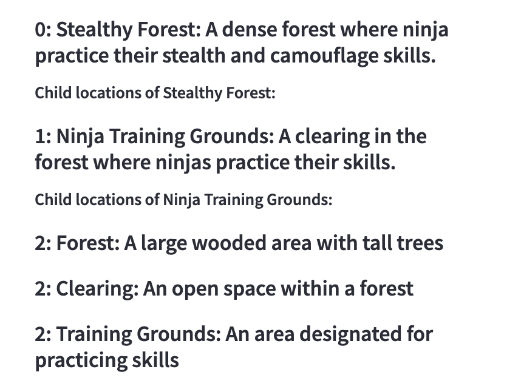

# ScenarioGenerator

This is a short project showing how to use recursive LLM function calls with a very short description to generate a complete scenario.

Try it at:

https://crewgenerator-4rgar97eqygbvpktzneuxj.streamlit.app/

